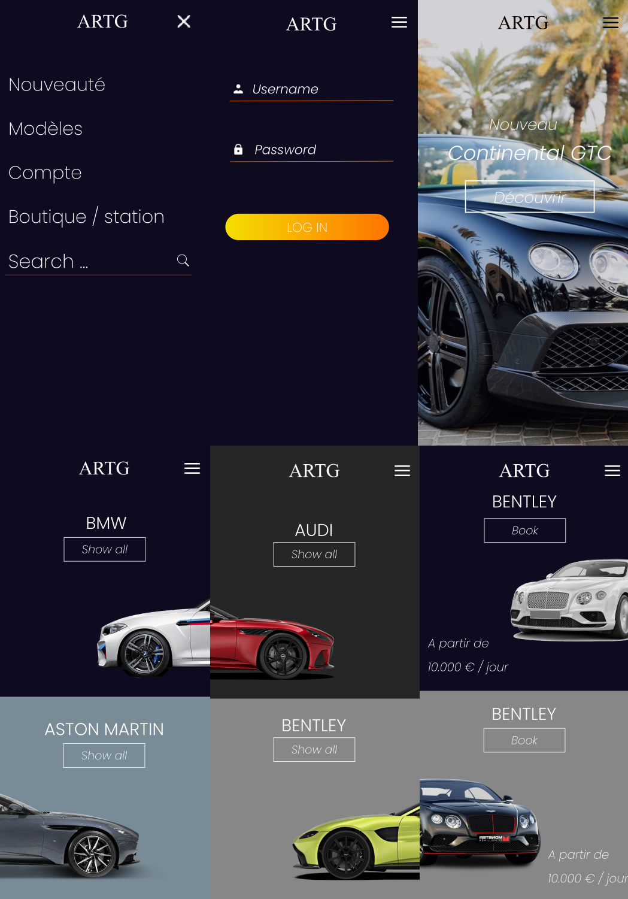

# ArtG

<p align="center">
<a style="justify-content: center" href="https://artgback.herokuapp.com/"></a>
</p>
<p align="center">
<a href="https://artgback.herokuapp.com/"></a>
<a href="https://artgback.herokuapp.com/"></a>
<a href="https://artgback.herokuapp.com/"></a>
</p>

ArtG is our project for the end of the 3rd year of Bachelor in Computer Science at Ynov Campus.

This project is a luxury car rental application created in React Native and Laravel.

# Back office and APi 
Back-office : https://artgback.herokuapp.com/
   
API : https://artgback.herokuapp.com/api/
    
# Model



You can access to the full model here https://xd.adobe.com/view/5f62c5f8-c15d-49b1-7692-52e816fe4ddf-2953/
    
# Requirements

* Clone this repository
* Install NodeJs :

    `sudo apt install nodejs`
* Install expo :

    `npm install expo-cli --global `

# How to launch the project

* cd to repo
* Install dependencies:

    `npm install`
* Run build 

    ```npm start```
* Start expo force tunnel
   
    ```expo start --tunnel```
* Get the QR Code from http://localhost:19002/

# Download

You can test our application by installing this APK : 
https://expo.io/artifacts/464f163d-1d35-44aa-b113-57ba0c11fe32

## Authors

| <a href="https://github.com/XDayonline" target="_blank">**Gianni Scantamburlo**</a> | <a href="https://github.com/Voltzy9" target="_blank">**Arthur Genthial**</a> |
| :---: |:---:|
| [](https://github.com/XDayonline)    |[](https://github.com/Voltzy9) | [](http://fvcproductions.com)  |
| <a href="http://github.com/fvcproductions" target="_blank">`https://github.com/XDayonline`</a> | <a href="http://github.com/fvcproductions" target="_blank">`https://github.com/Voltzy9`</a> 

## License

[](http://badges.mit-license.org)

- **[MIT license](http://opensource.org/licenses/mit-license.php)**
- Copyright 2020 © ArtG
